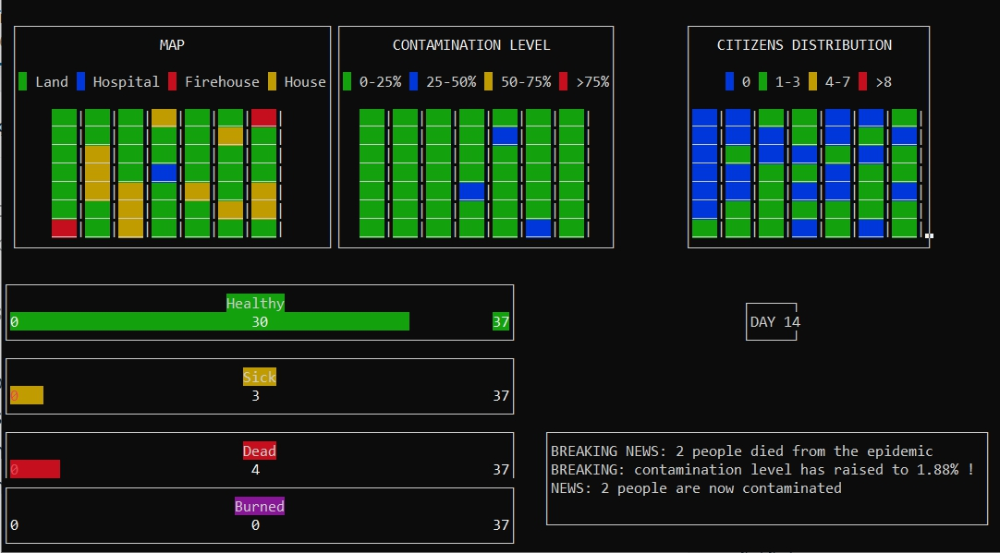

# Simulation epidemie

## Description

The aim of this project is to create an application that simulates the spread of a virus contamination in a city, as well as the fight against this contamination by some of its citizens.

The project implements the knowledge acquired during the operating system courses such as the different interprocess communication mechanisms (signals, pipes, message queues, shared memory), threads as well as semaphores.

## Dependencies

- ncurses: `sudo apt-get install libncurses5-dev`
- CDK:
    - Go to: https://invisible-island.net/cdk/#download and download the source
    - Unzip the folder
    - Follow instructions that are under INSTALL's file:
        -   > To build the library go into the Cdk distribution directory and follow 
            > the following steps:
            > 
            > 1) Run configure. This will create a Makefile with a default 
            > 	install directory root of /usr/local. If you want to 
            > 	change the default install directory use the --prefix 
            > 	command line argument on configure. For example, if you
            > 	want to install under /export/local instead, run the command:
            > 	./configure --prefix="/export/local"
            > 
            > 2) Type make. This will make the library, the example binaries
            > 	and the demonstration binaries.
            > 
            > 3) Type make install. This will install the CDK distribution. Look
            > 	at step 1 if you want to install other than /usr/local.

## Run

**\/!\ WARNING: this program contain a graphical interface which use the terminal, make sure it is wide enough before running the program! (refear to GUI recommendation) /!\\**

1. Make sure you have a `bin` folder at the project root
2. Use `make` to compile project
3. Run it with `make run_sim`
4. You can exit properly at any time by using `CTRL-C`
5. Enjoy!

## GUI recommendation

We recommend a terminal of 30 lines per 120 columns for a better experience such as the illustration below.

